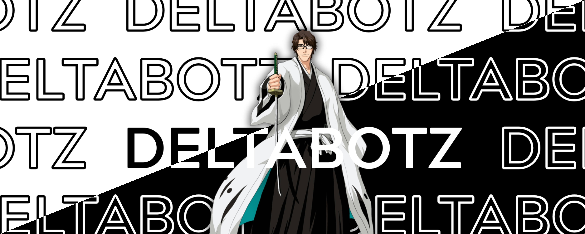

# DeltaBotz

Discord moderation bot with logging, honeypot traps, emoji copying, and per-server config via `/setup`.

- [Terms of Service](TOS.md)
- [Privacy Policy](PRIVACY.md)
## What it does

Moderation (ban, kick, mute, warn, purge, etc.), webhook-based logging, honeypot channels, auto-embed for social links, invite blocking, FAQ, and optional welcome/goodbye messages plus role restore on rejoin.

## Quick Start

```bash
npm install
```

2. **Set up your env**
   Rename `example.env` to `.env`, then add your `DISCORD_TOKEN`.
   You can also configure optional ids:
   - `BOT_OWNER_ID` — the bot owner Discord user ID
   - `ERROR_LOG_CHANNEL_ID` — channel ID for bot error logs
   - `GUILD_LOG_CHANNEL_ID` — channel ID for server join logs

3. **Run the bot**

   Using npx:
   ```npx ts=node index.ts```
   
or you can use bun like I do,
```bash
bunx ts-node index.ts
```

## Configure a server

Run `/setup` in Discord. From there you can set prefix, mod roles, log channels, honeypot, welcome/goodbye/role restore, auto-embed, and invite block.

Member join/leave logs need logging turned on and a member log channel (or a shared mod log channel). The bot needs **Manage Webhooks** and **Send Messages** in that channel; if webhook creation fails it falls back to posting the embed directly.

## Data on disk

```
configs/
  <guildId>/
    config.json      # Server configuration
    json.sqlite      # Per-guild database
```

## Project layout

```
index.ts
events/
commands/
  prefix/General|Moderators/
  slash/
loaders/
utils/
setup/
configs/
```

## Permissions

Commands under `Moderators/` need a role you pick in `/setup`. You can disable all mod commands globally from setup too.

## License

MIT

## Links

- Email: bsharesfky@gmail.com
- Discord: @bshar1865
- [Issues](https://github.com/bshar1865/DeltaBotz/issues)

Banner and PFP by [50n50](https://github.com/50n50) — thank you so much my beloved friend

---

Provided as-is; no uptime guarantees.
